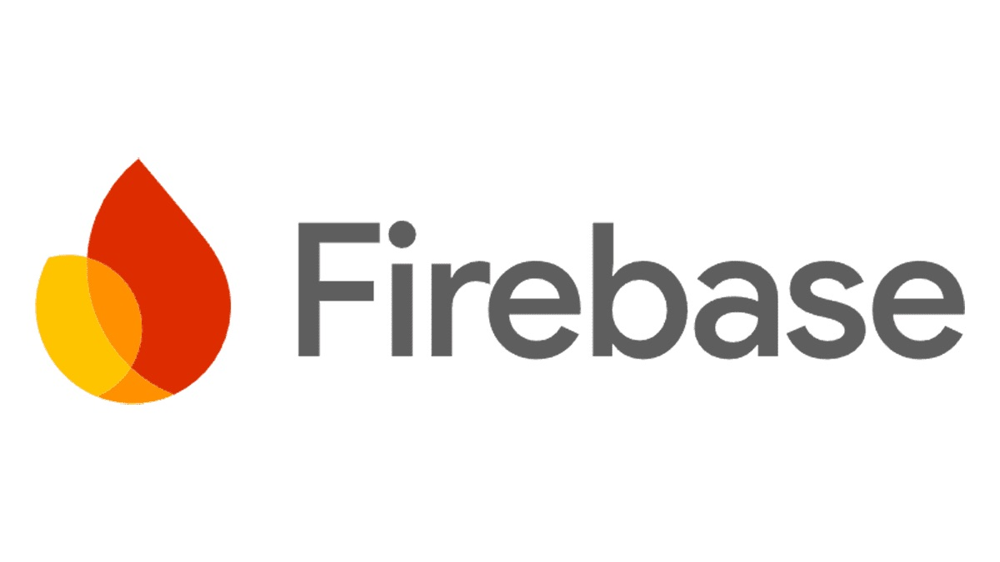

# Firebase-Testflight-CPSC357-Demo

<div align="center">
<p>
  
  &nbsp;&nbsp;&nbsp;&nbsp;
  
</p>

<p><em>A SwiftUI template for Firebase apps with TestFlight integration</em></p>
</div>

## 📱 Overview

A comprehensive open-source template for developing full-stack iOS applications with Firebase, featuring authentication, real-time database, cloud storage, and TestFlight integration.

## ✨ Features

- **Authentication**
  - Firebase Authentication with email/password
  - Registration & reset password
  - Authentication Error Handling

- **Navigation & Routing**
  - Custom router for seamless navigation
  - Separation of authenticated/unauthenticated flows
  - Deep linking support

- **Architecture**
  - MVVM with SwiftUI integration
  - Observable view models and dependency injection
  - AppEnvironment singleton to manage all ViewModels

- **Firebase Integration**
  - Firestore database
  - Authentication

- **UI Components & Network**
  - Reusable components with dark/light mode support
  - Network monitoring with offline handling and dynamic banners

## 🛠️ Technologies

- **Swift** & **SwiftUI** - Core development
- **Firebase** - Authentication, Firestore, Storage, Analytics
- **Swift Data** - Local persistence
- **Combine** - Reactive programming

## 📋 Requirements

- iOS 16.0+
- Xcode 15.0+
- Swift 5.9+
- Firebase (Google) account

## 🚀 Getting Started

### Prerequisites

- Xcode 15+ installed
- Firebase (Google) account

### Installation

1. Clone this repository
   ```bash
   git clone https://github.com/yourusername/firebase-ios-template.git
   cd firebase-ios-template
   ```

2. Set up your Firebase project
   - Create a new Firebase project at [Firebase Console](https://console.firebase.google.com)
   - Add an iOS app to your Firebase project
   - Download your `GoogleService-Info.plist` and add it to your project
   - Enable authentication methods (email/password supported by default)
   - Set up Firestore/Realtime Database rules

3. Open the `.xcworkspace` file to launch Xcode and run the project

## 🏗️ Project Structure

```
Firebase-iOS-Template/
├── App/                    # App entry point and AppEnvironment
├── Model/                  # Data models and structures
├── ViewModels/             # ViewModels for business logic
├── Views/                  # SwiftUI views by feature
│   ├── Auth/               # Authentication views
│   ├── Home/               # Main app views
│   ├── Community/          # Community-related views
├── NavigationRouter/       # Custom navigation system
├── Components/             # Reusable UI components
├── Utils/                  # Utility functions
├── NetworkMonitor/         # Network monitoring
├── Notifications/          # Push notification handling
```

## 🧩 Usage

### AppEnvironment Singleton

The template uses a shared AppEnvironment instance to manage all ViewModels:

```swift
// Access any ViewModel from anywhere in the app
AppEnvironment.shared.authViewModel.signIn(email: email, password: password)

// Add new ViewModels to the shared environment
@Published var newFeatureViewModel = NewFeatureViewModel()
```

This pattern allows for clean dependency injection and state sharing across the app.

### Authentication

The template provides a complete authentication flow:

```swift
// Login example
authViewModel.signIn(email: email, password: password)

// Registration example
authViewModel.register(email: email, password: password, name: name)

// Password reset
authViewModel.resetPassword(email: email)
```

### Navigation Router System

The template features a powerful custom navigation system:

```swift
// Navigate to a view within the authenticated flow
router.navigate(to: .home)

// Navigate with parameters
router.navigate(to: .communityDetail(id: "123"))

// Pop to previous view
router.dismiss()
```

**Router Types:**
- `AuthorizedRouter` - Navigation when user is logged in
- `UnAuthorizedRouter` - Navigation for auth flows (login, register)

**Key Benefits:**
- Type-safe navigation with compile-time checking
- Handles complex navigation stacks
- Supports push notifications routing
- Manages authentication state transitions

### App Navigation Flow

The application uses a structured navigation approach:

1. `Firebase_Testflight_CPSC357_DemoApp.swift` - Entry point that initializes Firebase
2. `RootView` - Root view container that determines auth state and routes notifications 
3. `AuthorizedRouter` - Manages navigation for authenticated users
4. `UnAuthorizedRouter` - Handles login/registration flows

```swift
// App entry point initializes Firebase and sets up the root view
@main
struct MyApp: App {
    @UIApplicationDelegateAdaptor(AppDelegate.self) var delegate
    
    var body: some Scene {
        WindowGroup {
            RootView() // Determines auth state and routes accordingly
        }
    }
}
```

This architecture ensures proper navigation based on authentication state and provides a clean separation of concerns.

## 🎨 Customization

### Theme and Styling

Modify the color schemes in `ColorType.swift` to match your app's design identity.

### Firebase Configuration

1. Edit `AppDelegate.swift` to configure Firebase services
2. Follow Firebase setup instructions:
   - Copy `GoogleService-Info.plist` to your project root
   - Add Firebase SDK via Swift Package Manager
   - Configure app delegate for initialization

## 🛫 TestFlight Distribution

1. Add a compatible App Icon according to the [iOS guidelines](https://developer.apple.com/design/human-interface-guidelines/app-icons)
2. Add appropriate signing & capabilities (Notifications, HealthKit, etc.)
3. Update Info.plist with required usage descriptions
4. Navigate to Product > Archive and distribute to App Store Connect
   - Requires valid Apple Developer subscription to deploy to TestFlight

## 🔥 Firebase Project Information

For security reasons, this template does not include actual Firebase credentials. You must create your own Firebase project and add your own `GoogleService-Info.plist` file.

## 👥 Best Practices

- Use environment variables for API keys when possible
- Follow the established MVVM pattern for new features
- Write tests for ViewModels and critical app logic
- Document your code for team members

## 👥 Contributors

- Luc Rieffel
- More contributors welcome!

## 📄 License

This project is available under the MIT license. See the LICENSE file for more info.

## 📞 Support

For support or questions, please open an issue on the GitHub repository. 